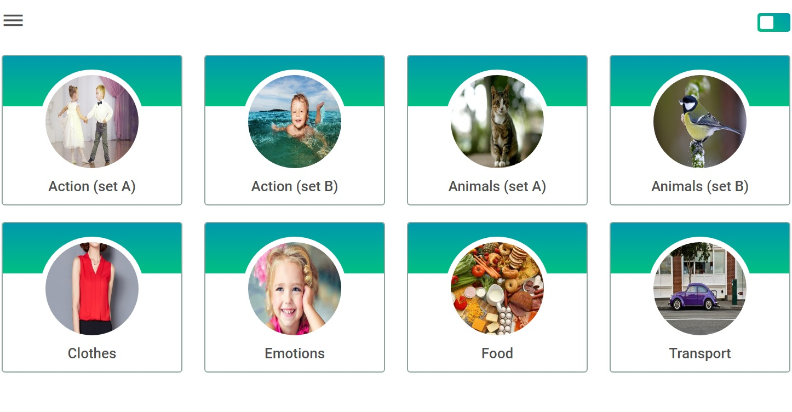

# English for kids

## Application structure:

1. Main page
2. Category page
3. Statistics page

## Requirements:

1. Main page

- on the main page there are links to pages with categories of words
- minimum number of categories - six
- each link contains a thematic picture and category name
- links are duplicated in the sliding side menu, which opens and hides by clicking on the icon in the upper left corner
- on the main page and on the category pages there is a Train/Play switch (training mode / game mode)

2. Category page

- the category page contains the name of the category and cards with words of the corresponding topic;
- the minimum number of cards with words in each category is eight;
- each card contains a thematic picture and a word in English;
- when you click on the card, the pronunciation of the word in English sounds;
- Each card has a button that, when clicked, flips the card. On the reverse side of the card is the translation of the word. When you click on the back of the card, nothing happens, the pronunciation of the word does not sound;
- the reverse rotation of the card to the front side occurs automatically when the mouse cursor moves beyond its borders.

3. Statistics page

- page with statistics contains a list of all categories, all words in each category, translation of each word. The minimum width at which the statistics page is displayed correctly is 320 px. It is not an error to have a scrollbar in a table with statistics;
- statistics are indicated next to each word - how many times the cards with this word were clicked in the training mode, how many times this word was guessed in the game mode, how many mistakes were made, the percentage of correct answers for each word in the game mode. After restarting the application, the statistics are saved;
- it is possible to sort data alphabetically, for numerical values ​​- by their value; Sorting can occur in forward and reverse order and must cover the entire range of data;
- on the statistics page there are buttons "Repeat difficult words" and "Reset". The "Reset" button resets the statistics. When you click on the "Repeat difficult words" button, a page for studying words with the highest percentage of errors opens, similar to the category page. The "Repeat difficult words" page can contain from zero to eight words, depending on how many words were guessed in the game mode and errors were made when guessing them. After pressing the "Reset" button, the number of words on the "Repeat difficult words" page is equal to zero.

## Application operation

The application works in training mode and in game mode.
When you load the app or reload the page, the app opens in workout mode.
Switching between training mode and playing mode occurs when you click on the Train/Play switch.

## https://kykysja-english-for-kids.netlify.app
